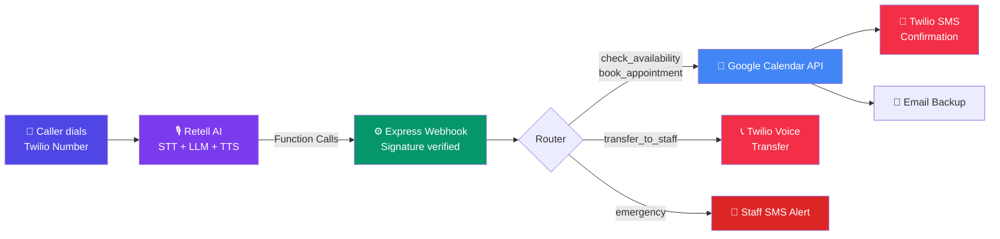
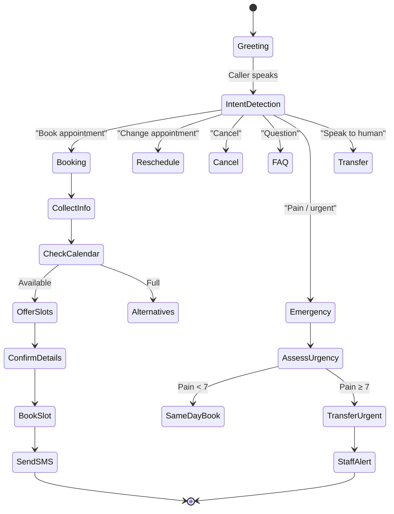

<div align="center">

# 🎙️ Voice AI Agent System

### Production-grade AI phone receptionist — answers calls, books appointments, handles emergencies, routes to staff

[](https://nodejs.org)
[](https://retellai.com)
[](https://twilio.com)
[](https://developers.google.com/calendar)
[](LICENSE)

<br/>

> **"Recovered 18 missed appointments in the first month — the agent paid for itself on day 3."**
> — Dental clinic client, New York

<br/>

[📞 Live Demo](#-live-demo) • [🎥 Watch It Work](#-watch-it-work) • [Features](#-features) • [Architecture](#-architecture) • [Verticals](#-supported-verticals) • [Edge Cases](#-edge-cases-handled) • [Setup](#-quick-start) • [Hire Me](#-for-hiring-clients)

</div>

---

## 📞 Live Demo

> 🟢 **Call the demo right now:** **`+1 (XXX) XXX-XXXX`**
>
> Tell Sophie you'd like to book a **teeth cleaning**. She'll check the calendar live, offer real time slots, confirm your details, book the appointment, and text you confirmation — all in under 90 seconds.
>
> *Demo agent runs 24/7. You'll receive a real SMS. No real appointment is booked at any actual clinic.*

---

## 🎥 Watch It Work

[](https://youtube.com/watch?v=YOUR_VIDEO_ID)

*Live phone call → real-time appointment booking → calendar updated → SMS confirmation, end to end.*

---

## 🔥 What This Does

Small businesses lose an average of **$126,000/year** from missed calls. 85% of callers who don't reach someone won't call back.

This system deploys a **24/7 AI phone agent** that:

- **Answers every call** — even at 2am, weekends, holidays
- **Books, reschedules and cancels appointments** directly into Google Calendar
- **Handles dental/medical emergencies** — detects urgency, routes to staff instantly
- **Sends SMS confirmations** automatically after every booking
- **Qualifies real estate leads** and books showings without a human agent
- **Never forgets, never gets sick, never puts callers on hold**

---

## ✨ Features

### 🧠 Intelligent Conversation Engine
- **12 conversation flows** covering every real-world scenario
- Natural language understanding — handles "tomorrow afternoon", "next Monday", "sometime this week"
- Graceful handling of angry callers, language barriers, silence, robocalls
- Context-aware: distinguishes new vs returning patients, emergency vs routine

### 📅 Real-Time Calendar Integration
- Checks live availability before confirming any slot — zero double bookings
- **Race condition prevention** — re-validates slot at booking moment (handles concurrent callers)
- Supports multiple doctors/providers on separate calendars
- Soft cancellations (events marked `[CANCELLED]`, never deleted — preserves history)

### 📱 Automated Notifications
- Booking confirmation SMS sent instantly after scheduling
- 24-hour and 2-hour appointment reminders
- New patient intake form link via SMS
- Staff alerts for emergencies and new patients

### 🛡️ Production-Grade Reliability
- Retell webhook signature verification (rejects spoofed requests)
- Exponential backoff on Google Calendar API rate limits
- 8-second function timeout (prevents Retell's 10s hard cutoff)
- Global error handler — server never crashes mid-call
- `unhandledRejection` + `uncaughtException` handlers at process level

### 📊 Post-Call Analytics
Every call is automatically analyzed for:
`call_outcome` • `patient_type` • `caller_sentiment` • `was_emergency` • `unhandled_requests`

---

## 🏗️ Architecture

### System Overview



### Conversation Flow



### Layered Architecture

```
                    ┌─────────────────────────────────────┐
                    │           INCOMING CALL              │
                    │    (Patient dials clinic number)     │
                    └──────────────┬──────────────────────┘
                                   │
                                   ▼
                    ┌─────────────────────────────────────┐
                    │           RETELL AI                  │
                    │   Voice Orchestration Layer          │
                    │   • Speech-to-Text (STT)             │
                    │   • LLM (GPT-4o mini)                │
                    │   • Text-to-Speech (ElevenLabs)      │
                    │   • ~600ms response latency          │
                    └──────────────┬──────────────────────┘
                                   │ Function Calls (webhook)
                                   ▼
                    ┌─────────────────────────────────────┐
                    │         EXPRESS SERVER               │
                    │   • Signature verification           │
                    │   • Rate limiting + Helmet           │
                    │   • 8s function timeout guard        │
                    │   • Graceful error handling          │
                    └────┬─────────┬──────────┬───────────┘
                         │         │          │
              ┌──────────▼──┐  ┌───▼────┐  ┌─▼──────────┐
              │  GOOGLE     │  │ TWILIO │  │  LOGGING   │
              │  CALENDAR   │  │  SMS   │  │  + ALERTS  │
              │             │  │        │  │            │
              │ • Free/busy │  │ • Book │  │ • Winston  │
              │   query     │  │   conf │  │ • Staff    │
              │ • Create    │  │ • 24hr │  │   SMS      │
              │ • Update    │  │   rmndr│  │ • Health   │
              │ • Soft del  │  │ • Staff│  │   check    │
              └─────────────┘  └────────┘  └────────────┘
```

---

## 🏢 Supported Verticals

| Vertical | Agent Name | Key Flows | Status |
|----------|-----------|-----------|--------|
| 🦷 **Dental Clinics** | Sophie | Book/Reschedule/Cancel, Emergency triage, FAQ, Insurance | ✅ Production |
| 🏠 **Real Estate** | Alex | Lead qualification, Showing scheduler, Discovery call booking | ✅ Production |
| 🔧 **Home Services** | Coming soon | Emergency dispatch, Job booking, Quote requests | 🔜 |
| 🏥 **Medical Clinics** | Coming soon | HIPAA-compliant scheduling, Referral routing | 🔜 |

---

## 🚨 Edge Cases Handled

**50+ edge cases across 5 categories** — documented in [`docs/EDGE-CASES.md`](docs/EDGE-CASES.md)

<details>
<summary><b>Booking Flow (15 cases)</b></summary>

- Requested slot taken → offers 3 alternatives automatically
- Race condition (2 callers booking same slot simultaneously) → pre-booking re-check
- Booking too close to current time → enforces configurable minimum advance hours
- Holiday/closed day → skipped in availability scan
- Patient changes mind mid-booking → restarts from date selection, no partial booking saved
- Vague time preference ("afternoon") → maps to 1:00 PM starting point
- Multiple services → books longest duration, notes both in calendar

</details>

<details>
<summary><b>Technical / API (15 cases)</b></summary>

- Google Calendar 429 rate limit → exponential backoff (2s, 4s, 8s)
- OAuth token expiry → auto-refresh via refresh token
- Retell function timeout → 8s guard returns graceful fallback before 10s hard limit
- Twilio error 21610 (unsubscribed) → permanent flag, no retry loop
- Server crash during call → `uncaughtException` logs + restarts via PM2

</details>

<details>
<summary><b>Caller Behavior (15 cases)</b></summary>

- Complete silence → 3s prompt → 5s bridge → 8s end call
- Angry/frustrated caller → validate → empathize → escalate (never argue)
- "Are you a robot?" → "I'm Sophie, the virtual receptionist!" (honest, not evasive)
- Caller wants to book for someone else → collects patient's info, not caller's
- Robocall/spam → silent end after 8s, no engagement

</details>

<details>
<summary><b>Emergency Scenarios (9 cases)</b></summary>

- Pain 7+/10 → immediate transfer (critical urgency) + staff SMS
- Knocked-out tooth → immediate transfer + ER guidance
- Emergency after hours → emergency phone number + callback logging
- Emergency with no same-day slots → first morning slot + OTC pain guidance

</details>

---

## 📈 Real-World Results

| Metric | Before AI Agent | After AI Agent |
|--------|----------------|----------------|
| Missed calls per week | 22 | 0 |
| New appointments (month 1) | Baseline | +18 recovered bookings |
| After-hours coverage | ❌ None | ✅ 24/7 |
| Staff time on phones | ~3 hrs/day | ~30 min/day |
| Patient no-show rate | Baseline | -15% (SMS reminders) |
| ROI payback period | — | **Day 3** |

---

## 🛠️ Tech Stack

| Layer | Technology | Why |
|-------|-----------|-----|
| Voice orchestration | [Retell AI](https://retellai.com) | Lowest latency (~600ms), best calendar integrations |
| LLM | GPT-4o mini | Cost-efficient, fast, reliable function calling |
| TTS / Voice | ElevenLabs | Most natural-sounding voices |
| Phone numbers | Twilio | Industry standard, global coverage |
| Calendar | Google Calendar API | Universal — every clinic already uses it |
| Backend | Node.js + Express | Fast, async-first, WebSocket support |
| SMS | Twilio Messaging | Reliable delivery, detailed error codes |
| Date / Time | date-fns + date-fns-tz | Timezone-safe, no moment.js bloat |
| Logging | Winston | Structured logs, file rotation |
| Deployment | Railway / Render / PM2 | Zero-downtime, auto-restart |

---

## ⚡ Quick Start

```bash
# 1. Clone
git clone https://github.com/ajit-data-ai/voice-ai-agent-system.git
cd voice-ai-agent-system

# 2. Install
npm install

# 3. Configure
cp .env.example .env
# Fill in your credentials (see docs/DEPLOYMENT.md for step-by-step)

# 4. Get Google refresh token (one-time)
node scripts/google-auth-setup.js

# 5. Run locally
npm run dev

# 6. Expose to internet (for Retell webhooks)
npx ngrok http 3000
```

Full deployment guide → [`docs/DEPLOYMENT.md`](docs/DEPLOYMENT.md)

---

## 📁 Project Structure

```
voice-ai-agent-system/
├── server.js                    ← Express server (entry point)
├── agents/
│   ├── dental/
│   │   └── system-prompt.txt    ← 12 conversation flows, full edge case handling
│   └── real-estate/
│       └── system-prompt.txt    ← Lead qualification + showing booking
├── config/
│   ├── agent-config.json        ← Retell agent config + 7 function schemas
│   └── clinic-config.json       ← Per-client config template
├── functions/
│   ├── calendar.js              ← Google Calendar (check/book/reschedule/cancel)
│   ├── sms.js                   ← Twilio (confirmations, reminders, alerts)
│   └── appointments.js          ← Orchestration layer
├── webhooks/
│   └── retell-webhook.js        ← Webhook handler + signature verification
├── utils/
│   ├── date-helpers.js          ← Natural language date/time parsing
│   └── logger.js                ← Structured logging
├── monitoring/
│   └── health-check.js          ← /health + /ping endpoints
├── scripts/
│   └── google-auth-setup.js     ← One-time OAuth token setup
└── docs/
    ├── ARCHITECTURE.md          ← System architecture, sequence diagrams, reliability patterns
    ├── DEPLOYMENT.md            ← Local → production deployment guide
    └── EDGE-CASES.md            ← 50+ edge cases documented
```

---

## 🔧 Per-Client Deployment

Each client gets their own isolated instance:
- Dedicated Retell AI agent (cloned from vertical template)
- Their own phone number (Twilio)
- Connected to their Google Calendar
- Customized prompt (name, hours, services, doctors, policies)
- Staff notification routing

**Setup time per new client: 2–4 hours** — covered by a one-time setup fee.

---

## 🧪 Testing

24 test scenarios covering happy path, edge cases, emergency flows, and failure modes.

```bash
cat tests/scenarios.md
```

No client goes live until all 24 scenarios pass.

---

## 💼 For Hiring Clients

I build, deploy, and maintain custom AI voice agents for service businesses — typically dental clinics, real estate agencies, home services, medical practices, and law firms.

**A typical engagement includes:**
- ✅ Custom-trained agent for your business (services, hours, providers, policies)
- ✅ Local phone number
- ✅ Direct Google Calendar / Calendly / Jane App integration
- ✅ SMS confirmations + appointment reminders
- ✅ Monthly performance report + ongoing prompt optimization
- ✅ Staff escalation routing for emergencies + complex cases
- ✅ Unlimited prompt updates as your business changes
- ✅ Production monitoring + uptime SLA

**🎁 Free 14-day pilot** available for qualifying service businesses — call the [live demo](#-live-demo) first, then book a discovery call.

📧 **Discuss your project:** [your-email@domain.com](mailto:your-email@domain.com) · 💼 [Upwork](#) · 🔗 [LinkedIn](#)

---

## 📄 License

MIT © [Ajit](https://github.com/ajit-data-ai)

---

<div align="center">

**Built for deployment. Tested on real calls. Ready for your business.**

[⭐ Star this repo](https://github.com/ajit-data-ai/voice-ai-agent-system) • [🐛 Report an Issue](https://github.com/ajit-data-ai/voice-ai-agent-system/issues)

</div>
