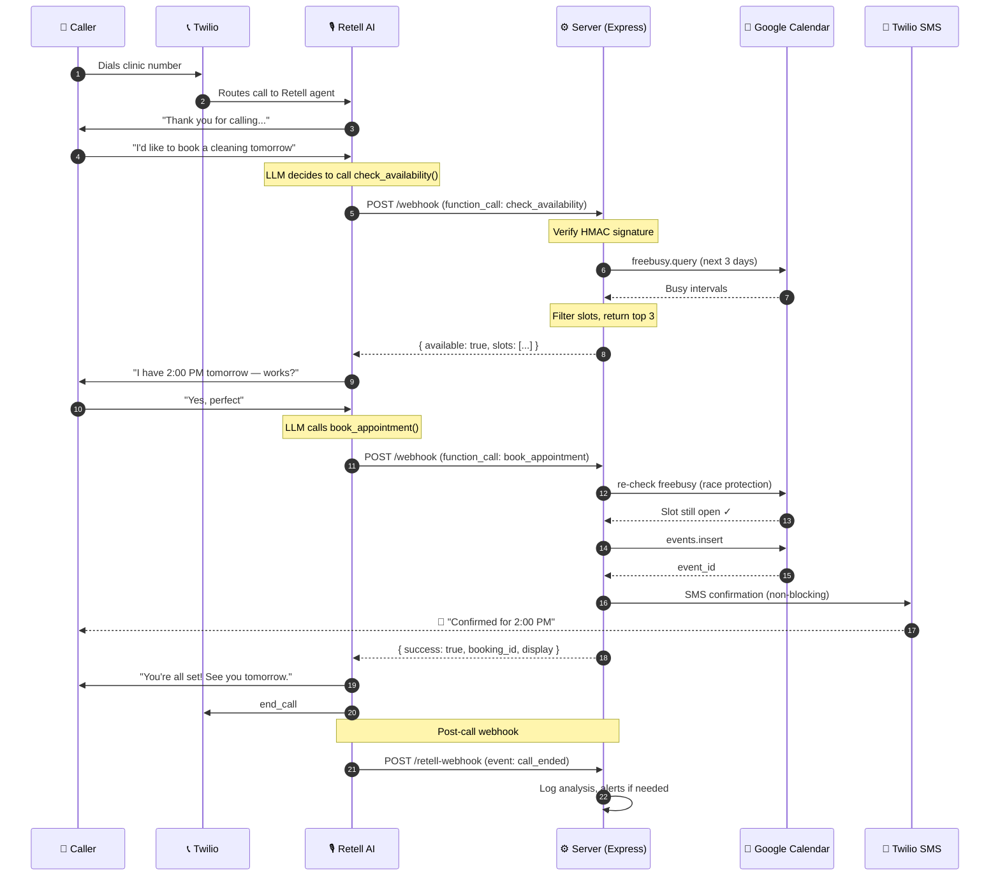

# System Architecture

Detailed architecture documentation for the Voice AI Agent System.

---

## 🎯 Design Goals

| Goal | How it's achieved |
|------|-------------------|
| **Sub-second response** | Retell AI's ~600ms latency + Express keeps function calls under 3s typical |
| **Zero downtime per call** | Stateless handlers + process-level error catching + graceful timeouts |
| **No double-bookings** | Pre-booking re-check against Google Calendar (race condition immune) |
| **Multi-tenant ready** | Per-client JSON config + agent prompt — no code changes needed |
| **Audit-grade logs** | Winston structured JSON + post-call analysis stored in Retell |

---

## 🏗️ End-to-End Call Flow



---

## 🧩 Component Responsibilities

### 1. Retell AI (External Service)
**Owns:** Voice capture, real-time transcription, LLM reasoning, voice synthesis.

| Sub-component | Latency target |
|---------------|---------------|
| STT (Speech → Text) | ~150ms |
| LLM (GPT-4o-mini) | ~300ms first token |
| TTS (Text → Speech) | ~150ms first audio chunk |
| **End-to-end** | **~600ms** |

**Why Retell:** Lowest latency in the market, native Cal.com/Google Calendar tooling, built-in HIPAA option.

---

### 2. Express Webhook Server (`server.js`)
**Owns:** Function call routing, integration glue, error containment.

**Critical responsibilities:**
- HMAC signature verification on every webhook
- 8-second function timeout (guards against Retell's 10s hard cutoff)
- Rate limiting (100 req/min per IP)
- Process-level error catching (prevents server crash during call)
- Health check endpoint for uptime monitoring

**Why Express:** Lightweight, mature WebSocket support, easy deployment to any platform.

---

### 3. Function Layer (`functions/`)
**Owns:** Business logic — what each tool actually does.

| File | Concern |
|------|---------|
| `calendar.js` | Google Calendar CRUD with retry + race protection |
| `sms.js` | Twilio SMS with retry + email fallback |
| `appointments.js` | Orchestration — combines calendar + SMS + alerts |

**Why separated:** Each function is testable in isolation, swappable (e.g. replace Google Calendar with Calendly).

---

### 4. Utility Layer (`utils/`)
**Owns:** Stateless helpers.

| File | Concern |
|------|---------|
| `date-helpers.js` | NLP date parsing ("tomorrow", "next Monday") → UTC datetimes |
| `logger.js` | Winston structured JSON logging |

---

### 5. Configuration Layer (`config/`)
**Owns:** Per-client behavior.

| File | Per-client field examples |
|------|--------------------------|
| `clinic-config.json` | Hours, services, doctors, holidays, insurance, escalation triggers |
| `agent-config.json` | Voice, latency tuning, function schemas, post-call analysis fields |

**Why config-driven:** Onboarding a new client = copying a JSON file + filling fields. No code changes.

---

## 🔒 Reliability Patterns

### Pattern 1: Pre-Booking Re-Check
**Problem:** Caller A asks "is 2 PM available?" → yes. Caller B simultaneously asks the same → yes. Both book. Double-booking.

**Solution:**
```js
async function bookAppointment(params) {
  // Re-verify availability RIGHT before booking
  const recheck = await checkAvailability(params);
  if (!recheck.available) {
    return { error: 'slot_taken', alternatives: recheck.slots };
  }
  // Only then proceed with the booking
  return calendar.events.insert(...);
}
```

The window between re-check and insert is ~50ms, vs ~5–10s in normal flow. 100x reduction in conflict probability.

---

### Pattern 2: Function Timeout Guard
**Problem:** Google Calendar API hangs for 11 seconds → Retell hits its 10s hard timeout → call drops.

**Solution:**
```js
async function withTimeout(fn, ms = 8000) {
  return Promise.race([
    fn(),
    new Promise((_, reject) =>
      setTimeout(() => reject(new Error('timed out')), ms)
    )
  ]);
}
```

If the function exceeds 8s, the server returns a graceful error to Retell, which voices: *"That's taking a bit longer than expected — let me have someone confirm with you shortly."* Call continues.

---

### Pattern 3: Non-Fatal Notifications
**Problem:** Twilio SMS fails → without protection, the booking error would propagate to Retell → caller hears "booking failed" even though calendar event was created.

**Solution:**
```js
// Booking returns success regardless of SMS outcome
const result = await calendar.bookAppointment(params);
smsConfirmation(...).catch(err => logger.error('non-fatal', err));
return result;  // Always reflects calendar state, not SMS state
```

---

### Pattern 4: Soft Cancellation
**Problem:** Hard-deleting a calendar event loses the audit trail. If a patient says "I never cancelled!" you have no proof.

**Solution:** Mark the event title `[CANCELLED] Original Title` + add timestamp to description + change color to graphite. Searchable, recoverable, defensible.

---

### Pattern 5: Process-Level Crash Protection
**Problem:** An unhandled promise rejection in one call's flow crashes the Node process → every concurrent call drops.

**Solution:**
```js
process.on('unhandledRejection', (reason) => {
  logger.error('Unhandled rejection', { reason });
  // Do NOT exit — keep server alive for other calls
});
```

Combined with PM2 / systemd for true uncaught exceptions (which DO require restart).

---

## 📊 Data Flow & Privacy

### What gets stored where

| Data | Location | Retention |
|------|----------|-----------|
| Call audio | Retell AI (encrypted) | 90 days (configurable) |
| Transcripts | Retell AI | 90 days |
| Post-call analysis JSON | Retell AI | 90 days |
| Appointment data | Google Calendar (client's account) | Per client policy |
| Patient phone | Calendar event extendedProperties | Per client policy |
| Server logs | Winston files / Papertrail / Logtail | 30 days default |
| SMS history | Twilio dashboard | 30 days |

### HIPAA Considerations
For healthcare clients:
1. Enable Retell HIPAA tier ($1,000/mo addon) — OR use Synthflow/Retell certified pipeline
2. Use Twilio HIPAA-eligible product line
3. BAA with Google Workspace (calendar holds PHI)
4. Server logs should NOT contain PHI — log booking IDs, not patient names

---

## 🧪 Scaling Characteristics

| Load | Behavior |
|------|----------|
| 1 concurrent call | Default, sub-second response |
| 10 concurrent | No measurable degradation (Node.js async) |
| 100 concurrent | Add horizontal scaling (PM2 cluster mode or Railway autoscale) |
| 1000+ concurrent | Add Redis for rate limiting, queue worker for SMS, read replicas for calendar reads |

**Bottlenecks (in order):**
1. Google Calendar API quotas (1M req/day default — plenty)
2. Twilio SMS throughput (1 msg/sec/number default — needs Messaging Service for bulk)
3. Retell concurrent call limits (depends on plan)

---

## 🔄 Multi-Client Deployment Model

### Option A: Single Server, Many Clients (recommended for <50 clients)
```
              ┌─────────────────────────────┐
              │  ONE Express Server         │
              │                             │
              │  Request → /webhook         │
              │  ↓ Look up agent_id         │
              │  ↓ Load config/clients/X.json│
              │  ↓ Execute with that config │
              └─────────────────────────────┘
```

### Option B: Server-per-Client (for HIPAA isolation / high-value clients)
```
   Client A     Client B     Client C
       │           │             │
   ┌───▼──┐    ┌──▼───┐     ┌───▼──┐
   │Server│    │Server│     │Server│
   └──────┘    └──────┘     └──────┘
```

Use Railway/Render's per-service isolation. Slightly higher cost (~$5/mo per client) but zero blast radius if one fails.

---

## 🛠️ Tech Decision Log

| Decision | Alternatives considered | Why this won |
|----------|------------------------|--------------|
| **Retell AI over VAPI** | VAPI, Bland AI, Synthflow | Lowest latency (600ms vs 800-900ms), best Calendar integration, HIPAA available |
| **Google Calendar over Cal.com** | Cal.com, Calendly, EHR systems | Universal — 95% of clinics already have Google Workspace |
| **Node.js over Python** | Python/FastAPI, Go | Async-first, mature SDK ecosystem, lower memory per concurrent connection |
| **Express over Fastify** | Fastify, Hono | Mature WebSocket ecosystem, Retell SDK has Express examples |
| **date-fns over Moment.js** | Moment.js, Luxon, Day.js | Tree-shakeable, immutable, native TZ via date-fns-tz, no future deprecation |
| **JSON config over DB** | PostgreSQL, MongoDB | Per-client config rarely changes; Git is the audit log; no DB ops overhead |

---

## 📖 Further Reading

- [DEPLOYMENT.md](DEPLOYMENT.md) — How to deploy this to production
- [EDGE-CASES.md](EDGE-CASES.md) — 50+ edge cases with handling strategy
